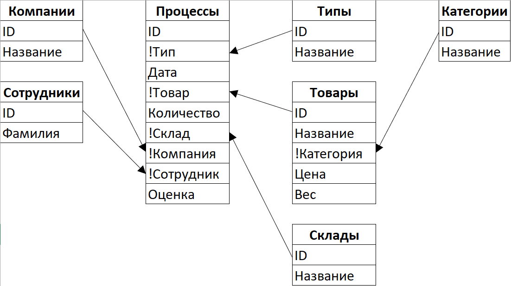
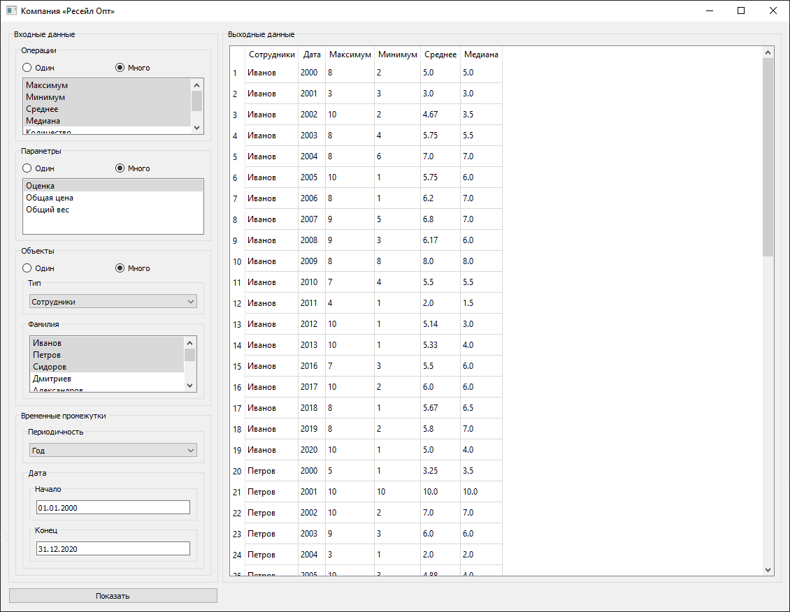

# pandas

Приложение позволяет анализировать большое количество технологических процессов компании, занимающейся оптовыми закупками и оптовыми продажами (соединять таблицы БД, фильтровать, группировать, агрегировать значения по столбцам).

Схема базы данных, с которой работает приложение. Основная таблица для анализа - "Процессы". Информация из других таблиц подтягивается к основной для отображения результатов анализа:

В файле **"data.xlsx"** содержатся все данные для анализа. Один лист - одна таблица в базе, первая строка листа - названия столбцов. Все данные искусственно сгенерированы.

Пример предварительного заполнения формы для анализа данных и вывода результатов:

В файле **"main.py"** весь Python-код программы:
- Для работы с таблицами данных используется **pandas**, для графического интерфейса - pyqt5; функции для работы с pandas - **calculate_grouped_processes** и **filter_processes**
- При анализе с помощью **pandas** используется множественное **соединение таблиц**, а также **фильтрация**, **группировка** и **агрегация** значений
- Для использования приложения необходимо заполнить форму: в блоке "операции" выбрать **операции агрегации**; в блоке "параметры" выбрать **столбцы для группировки и агрегации**; в блоке "Объекты" выбрать вспомогательную **таблицу БД для отображения** и соответствующие **значения для фильтрации**; в блоке "Временные промежутки" указать **периодичность для агрегации** и **фильтрацию по дате**
